# 组件样式共享和隔离问题

[toc]

整理自 [组件模板和样式（微信小程序官方文档）](https://developers.weixin.qq.com/miniprogram/dev/framework/custom-component/wxml-wxss.html) 。

- 本文以 uni-app 测试撰写，不确定微信原生和其他框架是否相同
- 样式共享和隔离对当前页面和组件生效，对其他路由的页面和组件均不会有影响
- 样式共享和隔离指的是在全局、页面、组件内定义了同一个选择器的样式时，会不会互相影响，本文后文提到的均是如此。
- 样式共享和隔离不会影响所有属性的继承性，也就是说，开启隔离后，会继承的样式依然会继承，比如 `color`, `font-size` 等，开启样式共享后，不会继承的样式依然不会继承，比如 `border`, `background` 等。

## options.styleIsolation

在页面或组件的根选项中，增加 `options` 对象，对象中使用 `styleIsolation` 字段来设置样式隔离或共享。

```js
options: {
  // 组件可选值：isolated | apply-shared | shared
  // 页面组件可选值：page-isolated | page-apply-shared | page-shared
  styleIsolation: 'isolated',
}
```

- `isolated` 组件外和组件内互不影响，完全隔离开。
- `apply-shared` 组件外部影响内部，内部不会影响外部。
- `shared` 组件内外互相影响，但不会影响设置了 `styleIsolation: 'isolated'` 的组件或页面。
- 当 Component 构造器用于构造页面 ，默认值将会是 `shared` ，另外还有以下值可用：
- `page-isolated` 隔离全局样式，页面的样式不会影响到其他自定义组件。
- `page-apply-shared` 隔离全局样式，页面样式不会影响自定义组件，但会被页面内那些设为 `shared` 的组件所影响。
- `page-shared` 隔离全局样式，页面样式会影响到页面内其他设为 `apply-shared` 或 `shared` 的组件，也会受到页面内那些设为 `shared` 的组件的影响。

## 示例

在全局、页面、组件 1 ， 组件 2 内分别都定义了 `.comp` 选择器的样式，并设置了红色边框（全局），绿色阴影（页面），蓝色字体（组件 1），无任何样式（组件 2）。

为了不受到继承样式的影响，所以此处全局和页面的 `.comp` 选择器内需要设置非继承属性，以便测试使用，另外增加 `padding` 和 `margin` 值以方便查看和区分。

全局样式：

```scss
.comp {
  border: 4rpx solid #f00;
  padding: 20rpx;
}
```

页面（index.vue）:

```xml
<template>
  <view class="comp">
    <view class="son">父组件的内容</view>
    <Comp>
      <view>插槽传入的内容</view>
    </Comp>
    <Comp2>
      <view>插槽传入的内容</view>
    </Comp2>
  </view>
</template>

<style lang="scss">
.comp {
  padding: 20rpx;
  margin: 20rpx;
  box-shadow: inset 0 0 8rpx 8rpx #0f0;
}
</style>
```

组件 1（Comp1.vue）：

```xml
<template>
  <view class="comp">
    <view class="son">子组件 1 的内容</view>
    <slot />
  </view>
</template>

<style lang="scss">
.comp {
  color: #00f;
  padding: 20rpx;
}
</style>
```

组件 2（Comp2.vue）：

```xml
<template>
  <view class="comp">
    <view class="son">子组件 2 的内容</view>
    <slot />
  </view>
</template>
```

### 所有文件都不设置 styleIsolation 的默认效果

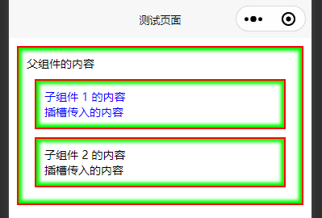

### 只对组件 1 设置 styleIsolation

效果分别如下所示：

- `isolated`

  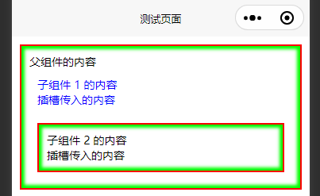

- `apply-shared`

  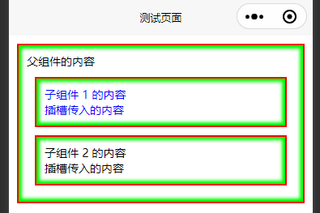

- `shared`

  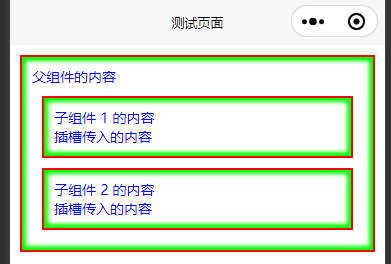

- `page-isolated`

  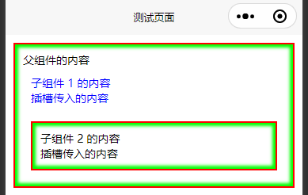

- `page-apply-shared`

  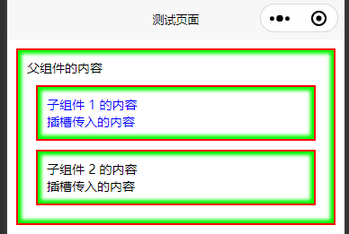

- `page-shared`

  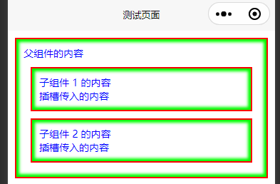

分别生效的样式总结：

属性值 | 页面 | 组件 1 | 组件 2 | 描述
-- | -- | -- | -- | --
未设置 | 全局， 页面 | 全局， 页面， 组件 | 全局， 页面 | 组件 1 接受了组件外的页面和全局样式
`isolated`  | 全局， 页面 | 组件 | 全局， 页面 | 组件 1 隔离了组件外的页面和全局样式
`apply-shared`  | 全局， 页面 | 全局， 页面， 组件 | 全局， 页面 | 组件 1 接受了组件外的页面和全局样式
`shared`  | 全局， 页面， 组件 | 全局， 页面， 组件 | 全局， 页面， 组件 | 组件 1 接受了组件外的页面和全局样式，同时也将组件内的样式共享出去影响了页面。

在组件内设置 `page-isolated`, `page-apply-shared`, `page-shared` 同以上三个对应值效果相同，因为这三个以 `page-` 开头的值是用于**将组件构造为页面（也就是组件作为路由文件路径）** 时使用的，所以用于组件时没有什么特殊的地方。

### 只对页面设置 styleIsolation

将之前对组件 1 的设置移除，只对页面设置 `styleIsolation` 。

> 通常普通的页面是不需要设置 `styleIsolation` 的，只是有时会将一个组件用于构造一个页面，也就是将组件作为路由文件路径时，可能会有需要设置 `styleIsolation` 的情况。

效果分别如下所示：

- `isolated`

  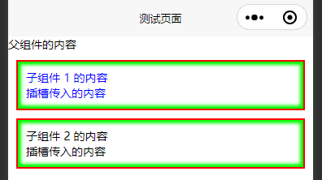

- `apply-shared`

  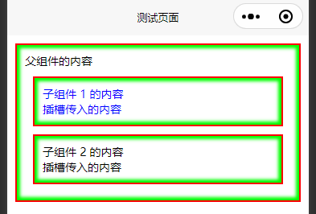

- `shared`

  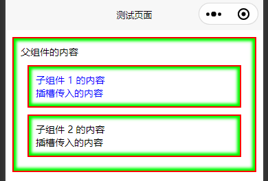

- `page-isolated`

  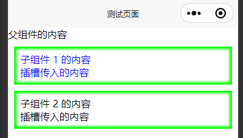

- `page-apply-shared`

  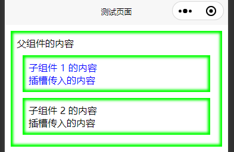

- `page-shared`

  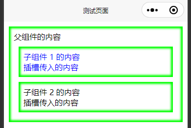

分别生效的样式总结：

属性值 | 页面 | 组件 1 | 组件 2 | 描述
-- | -- | -- | -- | --
未设置 | 全局， 页面 | 全局， 页面， 组件 | 全局， 页面 | -
`isolated`  | 无 | 全局， 页面， 组件 | 全局， 页面 | 页面被视为组件， 隔离了全局和页面的样式， 所以即使是页面内的样式都没有对页面组件生效
`apply-shared`  | 全局， 页面 | 全局， 页面， 组件 | 全局， 页面 | 页面被视为组件，但页面接受了组件外的页面和全局样式
`shared`  | 全局， 页面 | 全局， 页面， 组件 | 全局， 页面 | 页面被视为组件， 接受了全局，页面，内部组件的样式，但内部组件没有共享出样式
`page-isolated` | 无 | 页面， 组件 | 页面 | 页面隔离了全局样式，同时页面被视为组件，所以页面内的样式对页面组件也没有生效
`page-apply-shared` | 页面 | 页面， 组件 | 页面 | 页面隔离了全局样式，同时页面被视为组件，但接受了页面的样式
`page-shared` | 页面 | 页面， 组件 | 页面 | 页面隔离了全局样式，同时页面被视为组件， 接受外部和内部的样式，但内部组件没有共享出样式

### 同时对页面和组件 1 设置 styleIsolation

效果分别如下所示：

- 页面`page-isolated` ， 组件 `isolated`

  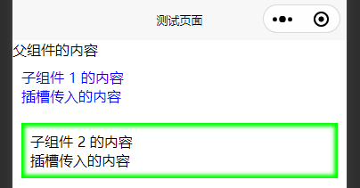

- 页面`page-isolated` ， 组件 `apply-shared`

  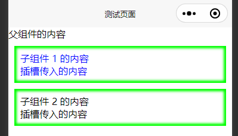

- 页面`page-isolated` ， 组件 `shared`

  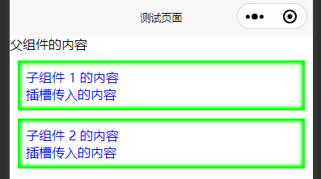

- 页面`page-apply-shared` ， 组件 `isolated`

  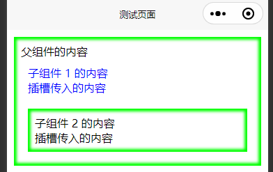

- 页面`page-apply-shared` ， 组件 `apply-shared`

  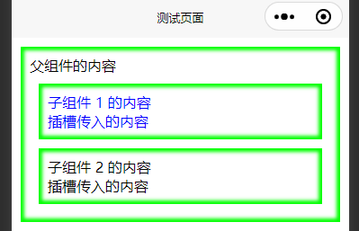

- 页面`page-apply-shared` ， 组件 `shared`

  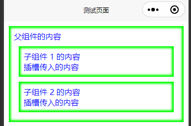

- 页面`page-shared` ， 组件 `isolated`

  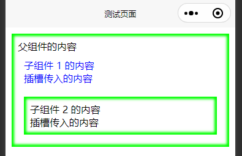

- 页面`page-shared` ， 组件 `apply-shared`

  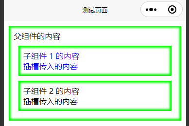

- 页面`page-shared` ， 组件 `shared`

  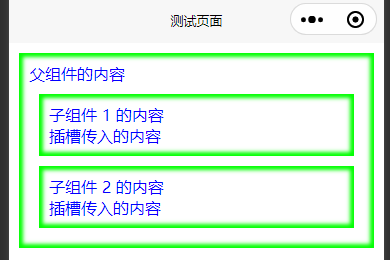

分别生效的样式总结：

页面值 | 组件值 | 页面 | 组件 1 | 组件 2 | 描述
-- | -- | -- | -- | -- | --
`page-isolated` | `isolated`  | 无 | 组件 | 页面 | 页面被视为组件， 隔离了全局和页面的样式， 所以即使是页面内的样式都没有对页面组件生效
`page-isolated` | `apply-shared`  | 无 | 页面， 组件 | 页面 | 页面被视为组件，但页面接受了组件外的页面和全局样式
`page-isolated` | `shared`  | 无 | 页面， 组件 | 页面， 组件 | 页面被视为组件， 接受了全局，页面，内部组件的样式，但内部组件没有共享出样式
`page-apply-shared` | `isolated`  | 页面 | 组件 | 页面 | 页面被视为组件， 隔离了全局和页面的样式， 所以即使是页面内的样式都没有对页面组件生效
`page-apply-shared` | `apply-shared`  | 页面 | 页面， 组件 | 页面 | 页面被视为组件，但页面接受了组件外的页面和全局样式
`page-apply-shared` | `shared`  | 页面， 组件 | 页面， 组件 | 页面， 组件 | 页面被视为组件， 接受了全局，页面，内部组件的样式，但内部组件没有共享出样式
`page-shared` | `isolated`  | 页面 | 组件 | 页面 | 页面被视为组件， 隔离了全局和页面的样式， 所以即使是页面内的样式都没有对页面组件生效
`page-shared` | `apply-shared`  | 页面 | 页面， 组件 | 页面 | 页面被视为组件，但页面接受了组件外的页面和全局样式
`page-shared` | `shared`  | 页面， 组件 | 页面， 组件 | 页面， 组件 | 页面被视为组件， 接受了全局，页面，内部组件的样式，但内部组件没有共享出样式

## 其他

此外，小程序基础库版本 2.2.3 以上支持 `addGlobalClass` 选项，即在 Component 的 `options` 中设置 `addGlobalClass: true` 。 这个选项等价于设置 `styleIsolation: apply-shared` ，但设置了 `styleIsolation` 选项后这个 `addGlobalClass` 会失效。
